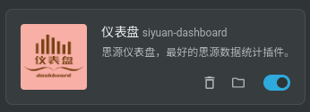
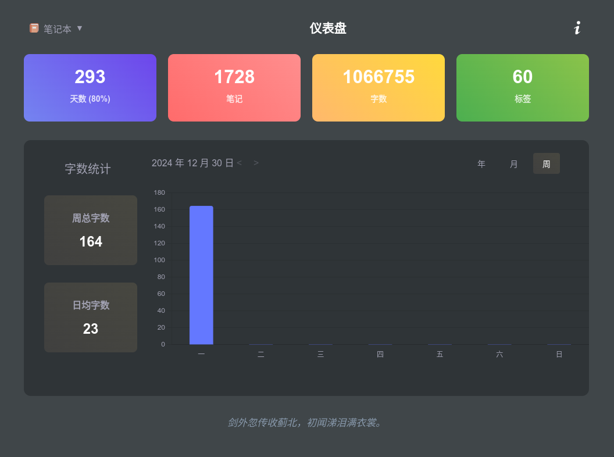
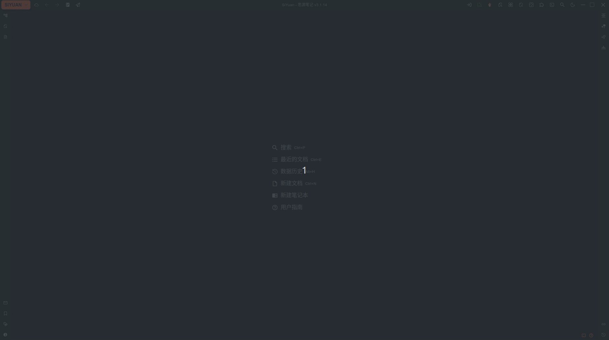

# siyuan-dashboard

[Chinese version README](./README.md)

siyuan-dashboard, which can be translated as "Siyuan Dashboard", is a Siyuan Notes plugin, mainly used to display the statistics of Siyuan Notes. Take a look at the effect diagram:

# Function introduction

Siyuan-dashboard is a data statistics plugin, and currently supports the following functions:

- Supports statistics of days, notes, words, and tags.

- Supports percentage display of usage days (actual usage days/total days).

- Supports total word count and average word count statistics for years, months, and weeks.

- Supports switching between years and months to view historical data.

- Adapts to light and dark modes.

> Currently, it is mainly adapted to the desktop, and the mobile terminal is not adapted for the time being. If necessary, it will be adapted later.

# Usage

Select the "Dashboard" icon in the top bar, and the statistics will be displayed in the upper right corner. Here is a demonstration:

# Version History

## v1.0.0

- Initial version, supports basic statistics functions.

## v1.0.1

- Fixed the problem that the image in README is not displayed in the plugin store.

## v1.1.0

- Multi-language adaptation supports English.
- Adjust the right margin of the icon.
- Adjust the spacing between the year, month, and day text in the chart.

## v1.1.1

- Fixed the problem that the image in README is not displayed in the plugin store.

# Feedback

If you encounter any problems during use, please raise [issues](https://github.com/jzmanu/siyuan-dashboard/issues) on Github.

# Support the author

If you approve of this project, please buy me a cup of coffee. This will [encourage](https://afdian.com/a/jzman) me to continue updating and create more useful tools~

## WeChat

## Alipay

## Github Star

Give a [Github Star](https://github.com/jzmanu/siyuan-dashboard) to support the author~

# Contact me

# Acknowledgements

- [Ancient Poetry One Word API](http://gushi.ci).
- [Siyuan Notes](https://b3log.org/siyuan).

